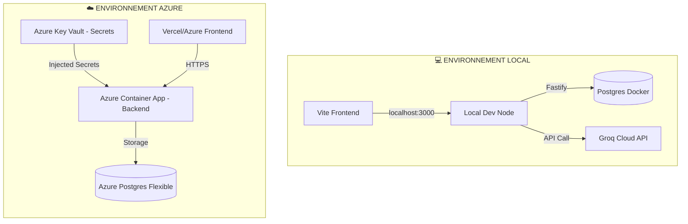
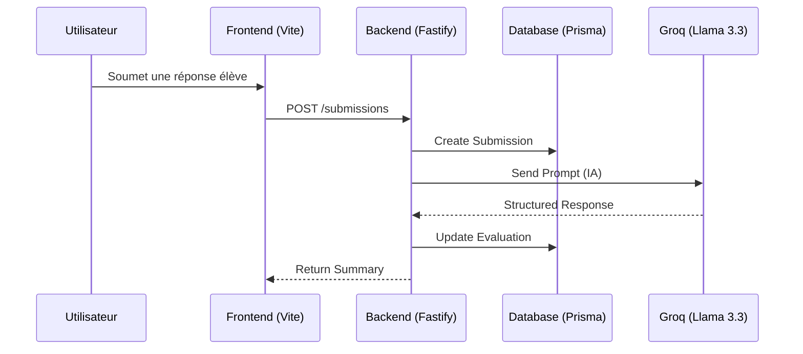

# 🐧 GradeScale (PoC) : Core Grading Engine pour l'Éducation Assistée par IA

> **Technical Sandbox & Architectural Concept**
> Ce dépôt présente une preuve de concept (PoC) se concentrant sur le moteur d'évaluation backend. Il explore l'implémentation de modèles de données et structurels permettant à l'IA d'assister les enseignants dans l'analyse granulaire des apprentissages, avec un focus sur la robustesse et la scalabilité.

---

## 🎯 1. Contexte Ingénierie & Métier

La conception de ce PoC répond à un double objectif :
1. **Transposition Architecturale** : Démontrer ma capacité à projeter des compétences éprouvées en ingénierie de la donnée (Python / SQL / Data Stack moderne) sur une stack Transactionnelle et Cloud-Native cible (Node.js, TypeScript, PostgreSQL).
2. **Domain-Driven Design (DDD)** : Intégrer une expertise métier profonde (15 ans d'enseignement de la Physique-Chimie) directement dans la structure de données et la logique métier, assurant que la technologie serve des cas d'usage pédagogiques concrets.

## 🏗️ 2. Décisions d'Architecture (System Design)

Le système est construit sur des principes applicatifs robustes, conçus pour la maintenabilité et la sécurité :

*   **Validation Gérée par le Schéma (Type Safety)** : Utilisation exclusive de **Zod** à la frontière de l'API pour parser les payload entrants et contraindre les réponses du LLM (Structured Outputs), garantissant un typage strict end-to-end.
*   **Couche de Service Isolée (Separation of Concerns)** : La logique analytique et l'orchestration de l'IA (remplissage des barèmes, appels API) sont découplées des routeurs Fastify, facilitant les tests unitaires et l'isolation du code.
*   **Infrastructure Managée (Azure PostgreSQL)** : Migration d'une architecture Neon vers un environnement Azure PostgreSQL Flexible Server, assurant une isolation complète des données et une gestion robuste des backups.
*   **Privacy By Design (RGPD)** : Intégration d'une couche de pseudonymisation interceptant et nettoyant les données étudiantes brutes avant leur exposition systémique à un fournisseur LLM externe.

## 🔭 3. Modélisation Pédagogique (Core Domain)

Le schéma relationnel modélise une évaluation formative granulée, au-delà du simple "score" :
*   **Rubriques et Critères** : Structuration hiérarchique dynamique pour évaluer les compétences conceptuelles transverses (Ex: Démarche d'investigation, validation des unités).
*   **Détection des *Misconceptions*** : Le moteur d'analyse sémantique est architecturé pour identifier les biais de raisonnement récurrents chez l'élève, facilitant la génération de feedbacks actionnables.

## 🛠️ 4. Stack Technique & Industrialisation

Le projet est conçu avec une double approche : **Simplicité locale** et **Scalabilité industrielle**.

*   **Logic (Local)** : Node.js, TypeScript, Fastify, Prisma, PostgreSQL.
*   **Industrial (Cloud)** : Docker (Multi-stage), Terraform (IaC), Azure Container Apps, Vitest (QA).
*   **Intelligence** : Inférence Groq LPU (Modèles Llama 3.3 70B) pour une latence minimale.

---

## 🚀 Installation & Développement Local

C'est la méthode recommandée pour contribuer ou tester le moteur d'évaluation rapidement.

### 1. Prérequis Système
*   **Node.js (LTS)** : Recommandé via **NVM**
    ```bash
    wget -qO- https://raw.githubusercontent.com/nvm-sh/nvm/v0.40.4/install.sh | bash
    source ~/.bashrc
    nvm install --lts
    ```
*   **Docker** : Installé (pour la base de données PostgreSQL locale).

### 2. Configuration Rapide
1. **Clone & Install** :
   ```bash
   git clone https://github.com/MichaelG-create/grade-scale.git
   cd grade-scale
   npm install          # Installation du Backend
   cd frontend && npm install  # Installation du Frontend
   cd ..
   ```
2. **Environnement** :
   `cp .env.example .env` (Remplissez votre `GROQ_API_KEY`).
3. **Database Locale** :
   ```bash
   docker-compose up -d
   npx prisma migrate dev
   npm run seed
   ```
4. **Lancement** :
   *   **Backend** : `npm run dev` (port 3000)
   *   **Frontend** : `cd frontend && npm run dev` (port 5173)

---

## 🏗️ Workflow & Infrastructure

### 🛠️ Commandes Makefile
Le `Makefile` centralise les commandes complexes :
*   `make test` : Lance Vitest (Unitaires + API Integration).
*   `make docker-build` : Crée une image de production optimisée (Multi-stage build).
*   `make build` : Compile le TypeScript proprement.

### ☁️ Déploiement Azure (Full Cloud)
L'infrastructure est entièrement pilotée par le code (IaC) via **Terraform**. Elle comprend Azure Container Apps, Postgres Flexible Server, Key Vault et Static Web Apps.

👉 **[Consulter le Guide de Déploiement Azure](./docs/DEPLOY_AZURE.md)**

---

---

## 📖 Guide d'Utilisation de l'Interface

Une fois le backend et le frontend lancés, ouvrez l'URL `http://localhost:5173`.

> [!IMPORTANT]
> **Démonstration en ligne** : Avant de commencer à tester l'évaluation des copies sur le site Vercel, **[cliquez ici pour réveiller l'API Backend](https://grade-scale.onrender.com/health)**. 
> Comme c'est une version gratuite sur Render, le premier chargement peut prendre ~1 minute. Une fois que vous voyez `{"status":"ok"}`, vous pouvez utiliser le frontend normalement.

### 1. Préparation de l'Évaluation
*   **Sélection** : Choisissez une question dans la liste (ex: *"Le mouvement d'un palet"*).
*   **Saisie** : Tapez la réponse d'un élève.
*   **Astuce (Test Rapide)** : Utilisez les **Pillules d'exemples** sous le champ de saisie. Elles injectent des réponses types pour tester la réaction de l'IA (correcte, erreur d'unité, etc.).

### 2. Analyse des Résultats (IA Groq)
Après avoir cliqué sur évaluer, l'intelligence artificielle de **Groq** analyse la copie en une fraction de seconde pour afficher :
*   **Note Finale** : Calculée dynamiquement sur le barème de la rubrique.
*   **Feedback Global** : Un commentaire qui résume la performance.
*   **Méconceptions Détectées** : L'IA identifie les erreurs de raisonnement types (ex: *"Confusion entre masse et poids"*).
*   **Détail par Critère** : Décomposition du barème avec justifications et conseils de remédiation (💡).

---

## 🏗️ Architecture Infrastructure (Azure)

Le dossier `infra/` contient tout le nécessaire pour déployer deux environnements isolés et scalables :

### Schéma Technique


### Flux de données (Evaluation)


*   **Environnement Dev** : Configuration légère pour les tests rapides et la validation.
*   **Environnement Prod** : Configuration optimisée pour la démonstration finale.
*   **Remote State** : L'état de l'infrastructure est stocké de manière sécurisée dans un **Storage Account Azure**.
*   **Compute** : Utilisation d'**Azure Container Apps** (Serverless).

---

## 🌐 Déploiement & Live Demo

Le projet est accessible en ligne pour démonstration immédiate :
*   **🚀 Interface Frontend (Vercel)** : [https://grade-scale.vercel.app/](https://grade-scale.vercel.app/)
*   **⚙️ API Backend (Render)** : [https://grade-scale.onrender.com/](https://grade-scale.onrender.com/)

> [!IMPORTANT]
> **Note sur la disponibilité** : Le Backend Render est en version gratuite (Cold Start ~1 min). Pour une performance et une réactivité maximale, préférez le déploiement sur **Azure Container Apps** via le code Terraform fourni.

---

## 📋 Roadmap & Industrialisation

- [x] **IaC** : Automatisation complète du déploiement via Terraform sur Azure.
- [x] **QA** : Mise en place d'une suite de tests (Unitaires & Intégration) avec Vitest.
- [x] **Docker** : Image stable et sécurisée pour le cloud (Registry GHCR).
- [x] **DevX** : Automatisation des tâches courantes via Makefile.
- [x] **Next Step** : Migration du Frontend vers Azure Static Web Apps.
- [ ] **Next Step** : Mise en œuvre d'un pipeline CI/CD GitHub Actions complet.

---
*Projet conçu avec rigueur par Michael GARCIA - Ingénieur & Enseignant.*