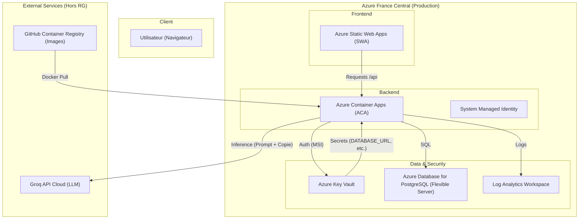

# Architecture GradeScale (Full Azure)

Ce document décrit l'architecture cible déployée sur Azure pour le projet GradeScale.

## Diagramme d'Architecture

## Composants Clés

1.  **Azure Static Web Apps (SWA)** : Héberge le frontend Vanilla JS. Déploiement automatique via GitHub Actions ou CLI.
2.  **Azure Container Apps (ACA)** : Héberge l'API Fastify/Node.js. Scalabilité automatique et gestion des révisions.
3.  **Managed Identity (MSI)** : Permet au backend de s'authentifier auprès du Key Vault sans mot de passe stocké dans le code.
4.  **Azure Key Vault** : Centralise la `DATABASE_URL` et la `GROQ_API_KEY`. Sécurisé et audité.
5.  **PostgreSQL Flexible Server** : Base de données relationnelle managée avec sauvegardes automatiques et haute disponibilité possible.
6.  **Log Analytics Workspace** : Centralisation de tous les logs applicatifs et d'infrastructure pour le monitoring.

## Flux de Données

1.  L'utilisateur charge le frontend depuis SWA.
2.  Le frontend envoie une copie d'élève à l'ACA.
3.  L'ACA récupère la clé Groq dans le Key Vault via son identité managée.
4.  L'ACA envoie la copie à Groq pour évaluation pédagogique.
5.  Le résultat est stocké dans Postgres et renvoyé à l'utilisateur.
